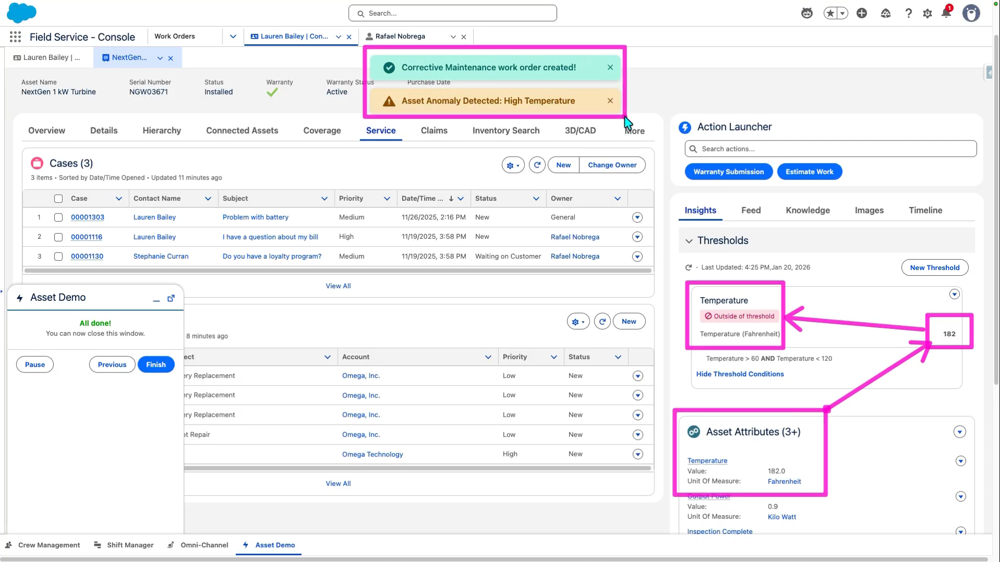

# SFS Asset Anomaly Detection Simulator

A guided simulation flow that demonstrates how **Connected Assets** and **IoT-driven service automation** can automate alerts and Work Order creation in Salesforce Field Service.

<p align="center">
  
</p>

## Overview

This flow allows a user to simulate an asset anomaly by updating an asset attribute with a new reading, evaluating that value against a defined threshold, and then automatically taking action if an anomaly is detected.

When the threshold is exceeded, the Flow:
- Surfaces an in-app toast alert
- Creates a new Work Order using the appropriate Work Type
- Sends a custom notification to the user

This illustrates how real-time asset data can proactively trigger service, alerts, and downstream workflows.

## What's Included

| Component | Type | Description |
|-----------|------|-------------|
| `RN_SFS_Asset_Anomaly_Simulator` | Flow | Main screen flow for the simulation |
| `showToast` | LWC | Flow-invocable toast notification component |
| `SDO_Flow_showToast` | LWC | Flow-invocable toast notification component (SDO variant) |
| `RN_Asset_Anomaly_Alert` | Custom Notification Type | Desktop notification for anomaly alerts |

## Installation

### Deploy to your org

```bash
sf project deploy start --source-dir force-app --target-org <your-org-alias>
```

Or using the manifest:

```bash
sf project deploy start --manifest manifest/package.xml --target-org <your-org-alias>
```

## Pre-requisites (Post-Deploy Configuration)

### 1. Work Type

Ensure you have a Work Type called **"Corrective Maintenance"** in your org. The flow looks up this Work Type by name to assign to the auto-created Work Order.

### 2. Asset Attribute: Temperature

This won't prevent the Flow from working, but ideally your Asset should have an **Asset Attribute** called **Temperature**.

To set this up:

1. **Setup > Object Manager > Asset > Page Layout > MFG Asset Layout > Related Lists** — Add the "Asset Attributes" related list to the page
2. On an **Asset Record > Related Lists > Asset Attributes > New Attribute Definition**:
   - **Name:** Temperature
   - **Unit of Measure:** Fahrenheit (you may need to create this)
     - Name: Fahrenheit
     - Unit Code: °F
     - Type: Custom
   - **Value:** 130 (so it's outside of the threshold we will define later)

### 3. Recordset Filter Criteria (for Thresholds)

1. **App Launcher > Recordset Filter Criteria > New**
   - Name & Description: Temperature
   - Source Object: Recordset Filter Criteria Monitor
   - Filtered Object: Asset
   - Conditions: Temperature > 60, Temperature < 120

### 4. Threshold Configuration

1. **Asset Record > Thresholds** (you might need to add this component to the page layout) **> New Threshold**
   - Name: Temperature
   - Description: Temperature (Fahrenheit)
   - Asset: *(select the asset you are using for your demo)*
   - Recordset Filter Criteria: Temperature
   - Save it

## Usage

1. Open the **RN_SFS Asset Anomaly Simulator Demo** flow from Setup > Flows, or add it as a button/action on the Asset record page
2. Enter the name of the asset you want to simulate the anomaly for
3. Enter a new temperature value and toggle "Simulate asset anomaly?" to true
4. The flow will:
   - Update the Asset Attribute value
   - Show a warning toast ("Asset Anomaly Detected: High Temperature")
   - Look up the "Corrective Maintenance" Work Type
   - Create a new high-priority Work Order linked to the asset
   - Show a success toast ("Corrective Maintenance work order created!")
   - Send a custom notification linking to the new Work Order

## Changes from Original

- **Removed hardcoded user lookup** — The original flow contained a Get Records element that looked up a specific SDO user by first name ("Alf") to send the custom notification. This has been removed. The flow now sends the notification to the **currently logged-in user** (`$User.Id`), which was already being captured at the start of the flow. No org-specific user dependencies.

## Notes

- The flow looks up a Custom Notification Type named **"RN_Asset Anomaly Alert"** — this is included in the deployment
- The notification is sent to the **running user** — no need to configure a specific recipient
- The flow creates Work Orders with **High priority** and a subject of "Corrective Maintenance (automated)"
- Work Order start date is set to the current time, end date is current time + 3 days
